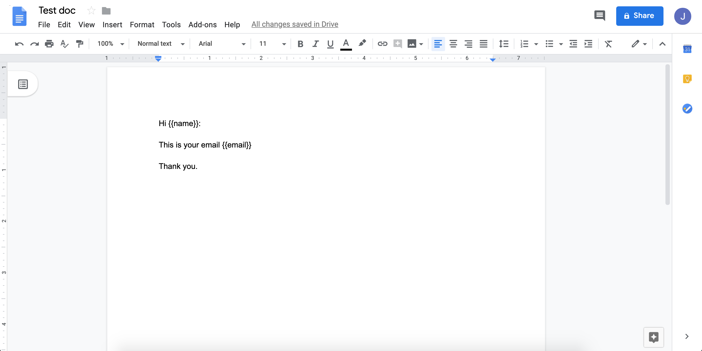
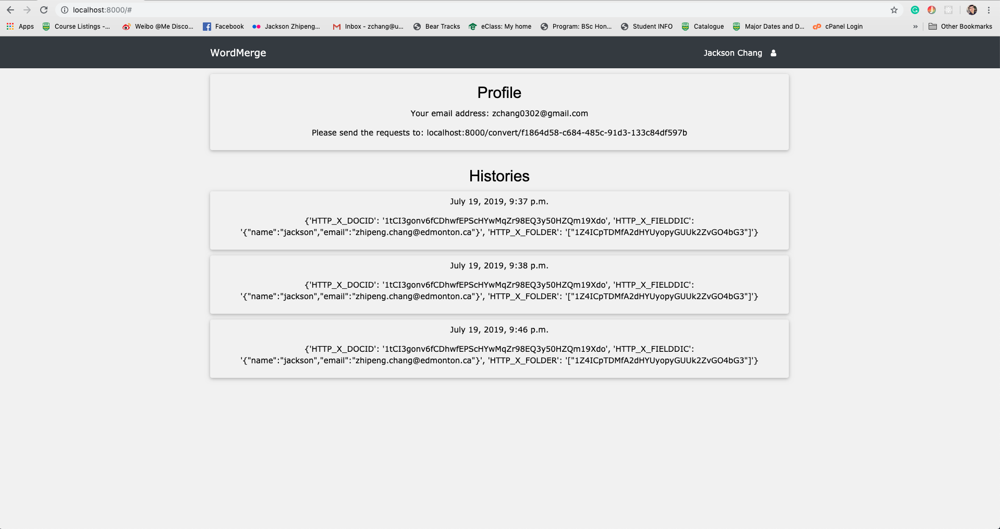
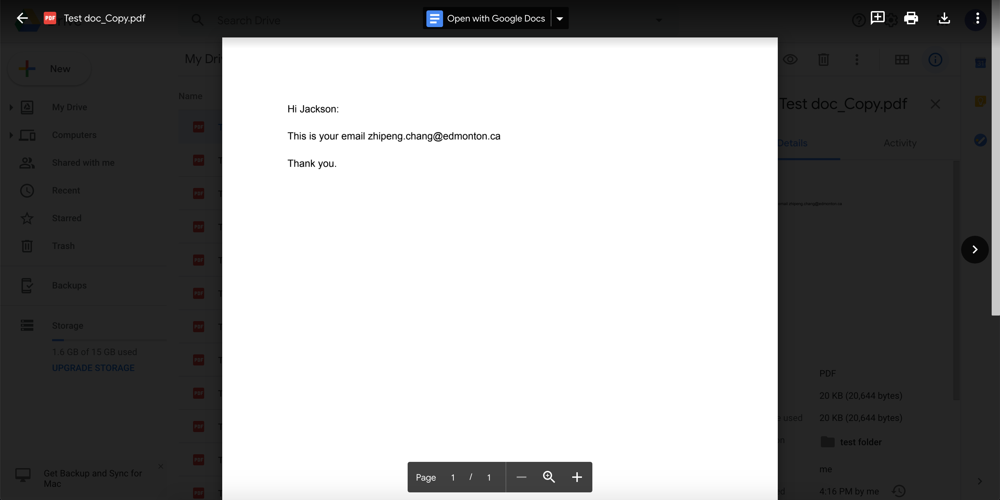

# WordMerge
### A web API server that can merge your Google Docs template, convert the merged Google Doc as a PDF and save it to your Google Drive folder.

## [Demo](https://drive.google.com/file/d/1EnVnQqWbGThGhjmKMfukTJ0QBjQa0PqR/view?usp=sharing)

<br>

### Things can do
1. Merge the Google Docs template you defined.
2. Share the merged Google Doc/PDF with a list of users
3. Save the merged Google Doc/PDF to a specific folder
4. API interface
<br>

## How to use:
### 1. Define your Google Docs template and put your variables into {{ }}.

### 2. Log in with your Google account and authenticate the WordMerge app with your Google Drive.

### 3. Send the API request to ../convert/{your_assigned_uuid}, with all the variables you would like to merge.

### 4. Once the template is successfully merged, the merged Google Doc will be saved to your Google Drive and you will get the link to the PDF version of the file.

### 5. Check all your requests histories on the main web page.

## To run the project locally:
```
On your terminal:

# Create a virtual environment
1. virtualenv venv --python=python3

# Activate your virtual environment
2. source venv/bin/activate

# Install all dependencies
3. pip install -r requirements.txt (please note that requirements_CI.txt is for TravisCI only)

# Run database migrations
4. python3 manage.py migrate

# Create a local super user
5. python3 manage.py createsuperuser

# Set the env variables
6. cp .env.example .env, then change all the values of the environment variables

# Run the server locally (by defult it's on http://127.0.0.1:8000/)
7. python3 manage.py runserver
```
## Codebase overview

```
wordMergeApp/
├── url.py                  # All app level endpoints 
├── GoogleDriveService.py   # Handlers all Google Drive services
├── GoogleOAuthService.py   # Handlers all Google OAuth services
├── WordMergeHandler.py     # Main entry point

wordMerg/
├── setting.py     # Settings to both wordMergeApp app and the project 
└── url.py         # All project level endpoints
```

## Headers

|Header|Required|Fromat|Example|
|--|--|--|--|
|X-DOCID|Yes|string|1tCI3gonv6fCDhwfEPScHaaaaZr98EQ3y50HZQm19Xdo
|X-FIELDDIC|Yes|dictionary|{"name":"Jackson","email":"zhipeng.chang@gmail.ca"}
|X-SHARE|No|list|["test.gmail.com","test2.gmail.com"]
|X-FOLDER|No|list|["1Z4ICpTDMfA2dHYUyopyGUUk2ZvGO4333"]
